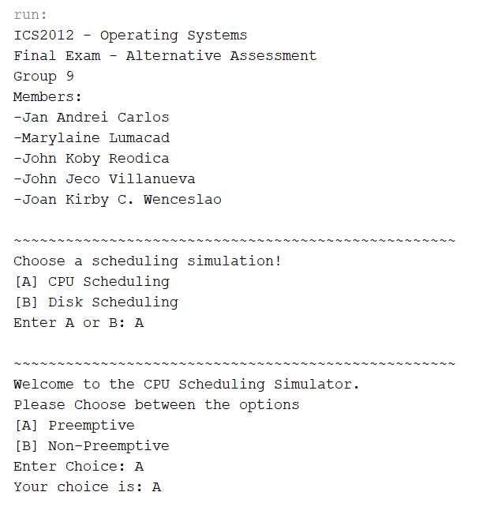
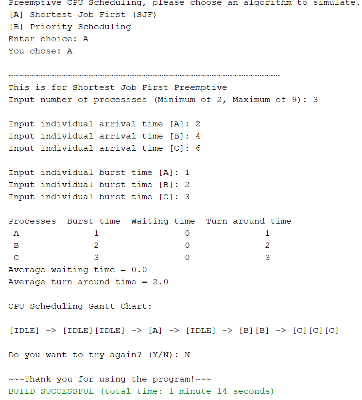

# OS
OS Project

A collaborative final academic project for a course that aims to simulate Disk Scheduling and Cpu Scheduling algorithms. The application includes the following algorithms:

CPU Scheduling

A) Preemptive
  1. Shortest Job First (SJF)
  2. Priority Scheduling
B) Non-Preemptive
  1. First Come First Serve (FCFS)
  2. Shortest Job First (SJF)

Disk Scheduling

1. First Come First Serve (FCFS)
2. Shortest Seek Time First (SSTF)
3. C-Scan
4. C-Look

# Menu Screen

# Sample Run

